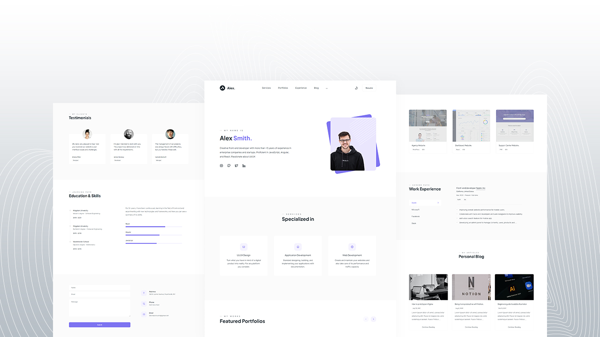

# Dev Chapter Portfolio
 - The real contact form connected to your Telegram
 - Dark and light theme
 - Load content while scrolling
 - Only with HTML CSS & JavaScript
 - Responsive design

### 🚀 Youtube video
https://www.youtube.com/

### 🔥 Demo
https://portfolio-dev-chapter.vercel.app/

### 📃 Resources

#### Images
https://unsplash.com

##### Portfolio images
- https://themefisher.com/products/promodise
- https://themefisher.com/products/sleek
- https://themefisher.com/products/dot
- https://demo.themefisher.com/reporter/

#### Icons
https://www.figma.com/community/file/942053544758339202

#### JS Libraries
- https://michalsnik.github.io/aos/
- https://lusaxweb.github.io/Kursor/
- https://swiperjs.com/
- https://github.com/jhildenbiddle/css-vars-ponyfill
- https://github.com/jonathantneal/svg4everybody
#### Fonts
- https://fonts.google.com/specimen/Inter
- https://fonts.google.com/specimen/Plus+Jakarta+Sans
